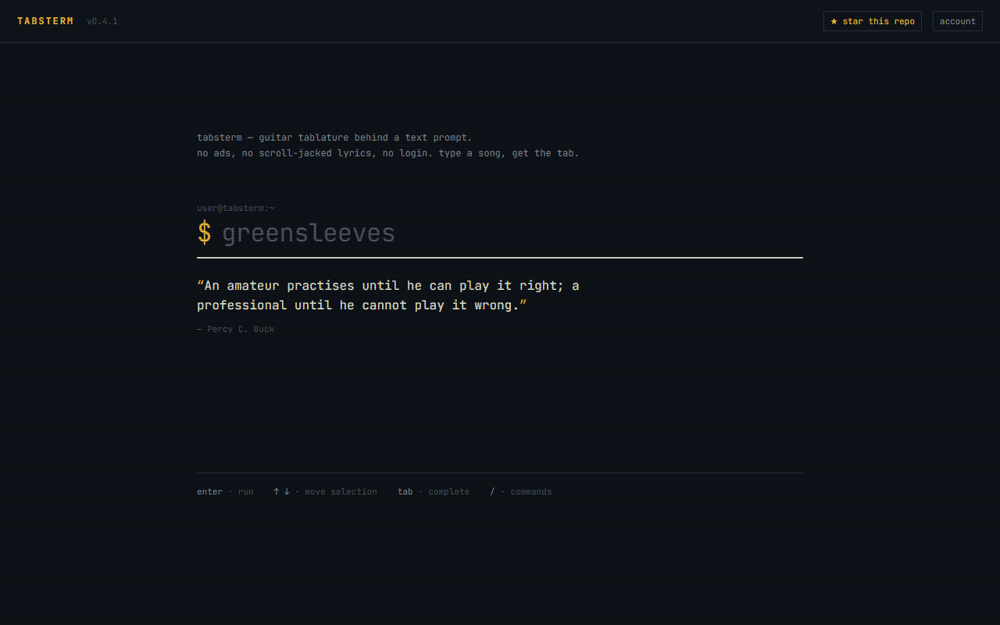
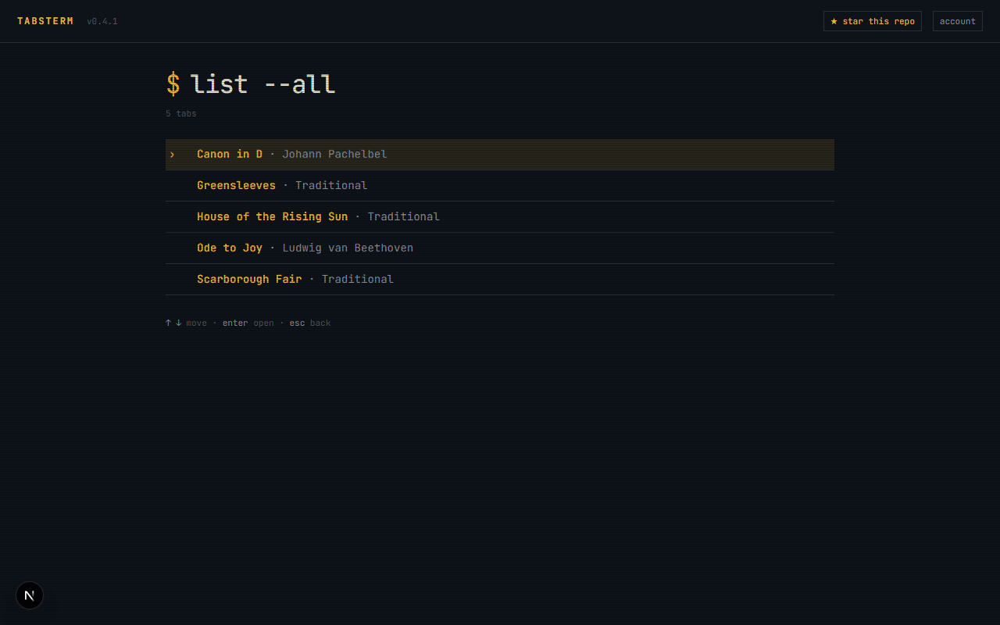
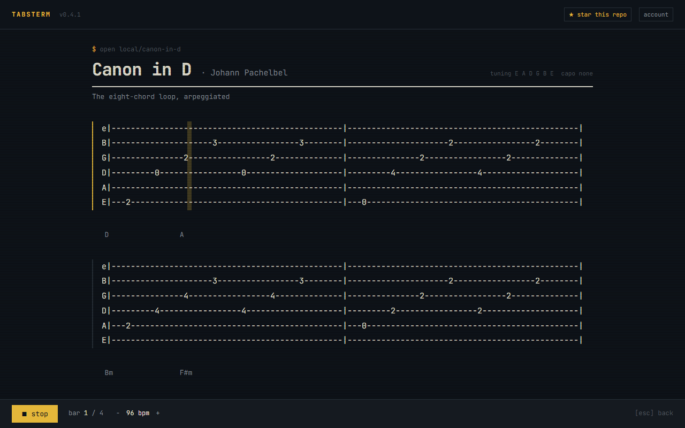
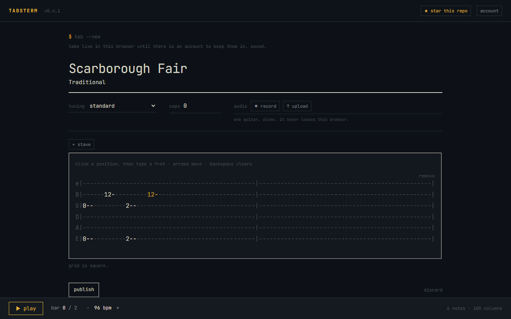
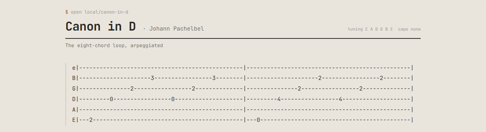
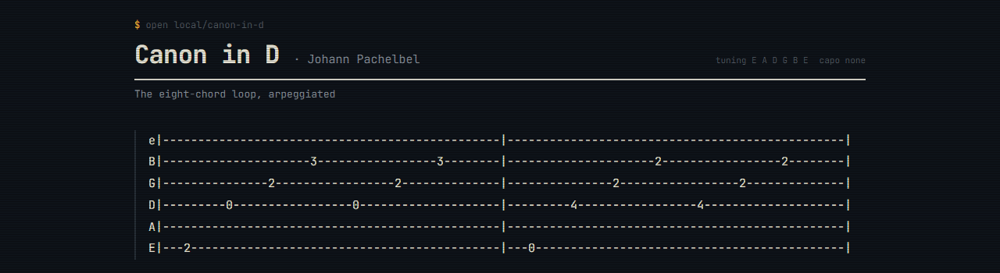
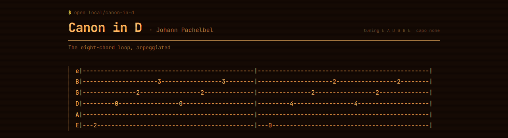
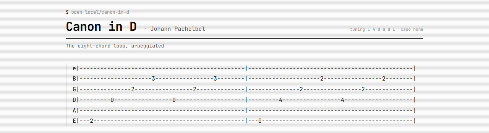

<div align="center">

# TabsTerm

**Somewhere to make your own guitar tablature, and keep it.**

Not a catalogue to read — a workshop to write in. Play something into your
microphone and get tablature back. Correct it position by position on a grid
that cannot fall out of line. Then press space and hear a guitar play it.



</div>

---

# Part 1 — What it is

## One prompt, and the tab

No ads. No autoplay video. No wall of lyrics you have to scroll past. No login
to read anything. You type, and you get tablature.

Everything happens through one text prompt. Type a song name to search it; type
a slash to see what else there is.

| Command | What it does |
| ------- | ------------ |
| `/new`  | write a tab, by hand or from audio |
| `/list` | every tab you have |
| `/rand` | open one at random |
| `/man`  | what TabsTerm is |
| `/theme`| cycle the theme |

Tab completes them the way a shell does — `/ra` then Tab finishes to `/rand`,
and pressing Tab again walks the rest of the list.



## The tab plays

A tab here is not a text file. Press `space` and a digital guitar plays it back
while a cursor walks the stave in time with the sound. The page follows the
cursor from one stave to the next, so you can keep both hands on the
instrument.

The bar counter, the tempo and the notes all come from the same reading of the
tab, so the cursor can never sit on a note the player is not about to play. Slow
it down with `-`, speed it up with `+`.



## Three ways to make one

**Play it into the microphone.** Pick up the guitar, hit record, play, hit stop.
The recording is analysed in your browser and comes back as a draft: notes
placed on a rhythmic grid, each one assigned to a real string and fret, with the
capo worked out from what it heard.

**Upload a recording you already have.** Same path, no microphone needed.

**Write it by hand.** Every position on the stave is a button. Click it and type
a fret.



That last one is the part most tab editors get wrong. Here a fret *replaces* a
fixed-width cell instead of being typed into a line, so a two-digit fret can
never push the strings below it out of column. The grid cannot break, because
there is no way to write into it that would break it. There is no raw text box
to fall out of sync with.

Tablature also never scrolls sideways. A stave is two bars wide, which is
exactly what the reading column fits — so you read down a column instead of
dragging a page left and right.

## Four themes

Paper, CRT, amber and mono. `t` cycles them from anywhere.

| | |
|---|---|
| **paper** | **crt** |
|  |  |
| **amber** | **mono** |
|  |  |

Monospace here is functional, not a costume: tablature only reads if every
character is the same width.

## Your work is yours

**Nothing you make is ever published.** Every tab belongs to the account that
made it and is visible to nobody else. There is no sharing, no public link, no
feed. That is the design, not a missing feature.

It is also what makes the rest possible. Ultimate Guitar and Songsterr are
catalogues that exist because they pay publishers, which is why they can only
show you what they have cleared. A private workshop has no such wall: you can
transcribe a recording you own, for yourself, because that is personal use
rather than distribution.

**Your audio never leaves your browser.** The analysis runs on your own machine.
Only the resulting tablature is stored — the server never fetches, downloads or
holds a recording.

**Nothing here is scraped.** No other site's tab database was copied to fill
this one. The five example pieces that ship with it are hand-written
transcriptions of public-domain and traditional works, each with its
provenance, so there is something to hear and something to edit on the first
visit.

## Keyboard first

| | |
| --- | --- |
| `enter` | run what is in the prompt |
| `tab` / `shift+tab` | complete a command, forwards or back |
| `↑ ↓` or `j k` | move the selection |
| `esc` | back |
| `space` | play or stop, on a tab |
| `e` | edit, on a tab that is yours |
| `t` | cycle the theme, anywhere |

Playback is sound, so nothing depends on hearing it — the moving cursor carries
the same information on screen.

---

# Part 2 — For developers

## Run it

```bash
npm install
npm run dev
```

That is the whole setup. It boots on `:3000` with five tabs in the library, no
account server and no configuration — drafts live in `localStorage`.

| Script | |
| ------ | --- |
| `npm run dev` | dev server on `:3000` |
| `npm run build` | production build |
| `npm run check` | typecheck + lint + unit tests |
| `npm run test:e2e` | Playwright, boots its own dev server |
| `npm run lint:fix` | Biome autofix + import sorting |

Formatting is Biome, not Prettier or ESLint. Run `npm run lint:fix` before
committing.

## Configuration

Copy `.env.example` to `.env.local`. Every variable is parsed by Zod at boot
(`src/lib/env.ts`), so a bad value fails immediately with a readable message
rather than at the first request.

Accounts are optional. With neither Supabase variable set, the app runs exactly
as it does above — which is how the e2e suite runs and how a fresh clone builds.
Setting **one without the other throws at startup**: a half-configured
deployment would keep everyone's tabs in a browser while its operator believed
there were accounts.

```bash
NEXT_PUBLIC_SUPABASE_URL=https://your-project-ref.supabase.co
NEXT_PUBLIC_SUPABASE_ANON_KEY=...
```

Both are public by design — the anon key is meant to ship to browsers. What
protects the data is row-level security, one policy per table in both
directions, in `supabase/migrations/`.

## Stack

| Layer | Choice | Why |
| ----- | ------ | --- |
| Framework | Next.js 16 (App Router, Turbopack) | RSC, streaming, route handlers, typed routes |
| Runtime | React 19.2 + React Compiler | Auto-memoization; no manual `useMemo` churn |
| Language | TypeScript (strict, `noUncheckedIndexedAccess`) | |
| Styling | Tailwind CSS v4 (`@theme` tokens) | Tokens live in one file; restyling is a token edit |
| Data fetching | TanStack Query | Cache, dedupe, abort on the client |
| URL state | nuqs | `q` and `view` live in the URL — shareable |
| Theming | next-themes | `data-theme` on `<html>`: paper / crt / amber / mono |
| Validation | Zod v4 | Env, API boundaries, upstream responses |
| Client state | Zustand | Session, modal state, local drafts |
| Accounts | Supabase (`@supabase/ssr`), optional | OAuth sign-in + owner-only Postgres |
| Audio | Basic Pitch (Spotify) + TensorFlow.js | Note detection, in the browser |
| Playback | Web Audio, Karplus–Strong synthesis | A plucked string, without a sample pack |
| Lint / format | Biome | One fast binary instead of ESLint + Prettier |
| Unit tests | Vitest + Testing Library | |
| E2E | Playwright | |

Motion and 3D packages (`gsap`, `motion`, `lenis`, `three`, `@react-three/*`)
are installed but imported nowhere, so they cost nothing until a design pass
needs them.

## Layout

```
src/
  app/
    page.tsx                        the terminal — home and results screens
    song/[provider]/[id]/page.tsx   the reader; `mine` reads the browser's own store
    new/page.tsx                    the editor; `?id=` resumes, and is where `edit` lands
    random/page.tsx                 307s to a tab picked on the server
    auth/callback/route.ts          trades the OAuth code for a session cookie
    api/search|tabs|tab/…           JSON, for the client and for no-JS
    globals.css                     theme tokens (--tt-*) + term-* utilities
  components/
    chrome/                         header, modals, theme cycle
    terminal/                       prompt, ghost typer, slash commands, screens
    editor/                         the cell grid and the transcribe controls
    tab/                            reader, playback bar, block renderer
  hooks/                            playback, autoscroll, the library
  lib/
    tab/                            grid, cells, parser, ASCII writer, fretting
    audio/                          decode, transcribe, synthesise
    tabs/contract.ts                domain model + Zod schemas + TabProvider
    supabase/                       config (optional) + browser / server clients
  server/tabs/                      `server-only`; imports the contract, never the reverse
    registry.ts                     fan-out, dedupe, graceful degradation
    providers/local.ts              the tabs committed to this repo
  data/seed-tabs.ts                 the shipped library
  stores/                           zustand: session, ui, drafts
  proxy.ts                          refreshes the Supabase session before rendering
supabase/migrations/                schema, with owner-only RLS from the first line
```

It is `src/proxy.ts`, not `middleware.ts` — Next 16 deprecated that name and
errors if both exist, while every Supabase guide still says middleware. It has
to be there: a Server Component cannot set cookies, so without a proxy
refreshing the token before render you get random logouts.

## The parts worth knowing

A handful of decisions here look arbitrary until you know what went wrong
without them. The short version is below; [CLAUDE.md](CLAUDE.md) has the full
list, each rule with the failure that put it there.

**The grid is the whole design.** Every notation position is `CELL_WIDTH`
characters wide (3), so `0--`, `12-` and `---` all measure the same. One
character per position — the usual convention — breaks above the ninth fret: a
two-digit fret either pushes everything after it out of line or silently eats
the next time position. Two characters fixes that but leaves `12` touching the
next `12`; the third keeps a dash after every fret.

`CELL_WIDTH` is not a constant you can edit. Three things follow it:
`COLUMNS_PER_BEAT`, the shipped library (`node scripts/normalise-seeds.ts --from
<old>`), and the drafts store's persist `version` plus a `regrid` migration for
tabs already in someone's browser. Use `regrid` for that, never `normaliseGrid`
— the latter reads every *character* column as a position and doubles the length
of the piece.

**A stave is `BARS_PER_STAVE` bars, and that is enforced where staves are
written.** Two bars, 100 characters, what a 980px column fits at 15px monospace.
`blankStave` and `notesToAscii` both read it, `setCell` cannot widen a stave,
and a test pins the shipped library. The reader deliberately does not wrap:
wrapping would break bars to hide a layout mistake.

**A blank line between staves is structure, not spacing.** A stave is a *run* of
consecutive stave lines, so two written back to back are one twelve-string stave
that falls back to a six-string tuning and plays half of itself. `appendBlock`
keeps the line when a tab grows; `removeLines` keeps it when a block between two
staves is deleted.

**A fret number is not a pitch.** Tab is written relative to the capo, so
anything that sounds a note has to add the capo to the open string.
`parseTabNotes(content, tuning, capo)` does it, and every caller has to pass it.
Transcription runs `detectCapo` *before* `assignFrets` for the same reason — the
capo decides which neck the notes are being placed on.

**Tab data never lives in components.** Sources implement `TabProvider`
(`src/lib/tabs/contract.ts`) and are registered in `src/server/tabs/registry.ts`.
A new source is a file in `providers/` plus an entry in `TAB_PROVIDERS`.
`searchAllProviders` may only *narrow* that list with the client's `?provider=`,
never widen it — otherwise anyone could switch on a source the operator turned
off. There is an e2e test pinning that.

**Design tokens are the `--tt-*` variables in `src/app/globals.css`**, one block
per theme. The `@theme inline` block maps them to `term-*` utilities and
components reference those names, never raw colours. Note that `@theme inline`
does not emit the custom property — anything hand-written CSS reads back with
`var(--token)` has to live in a plain `@theme` block instead.

## Testing

```bash
npm run check        # typecheck, lint, unit tests
npm run test:e2e     # Playwright
```

The e2e suite is pinned to the **no-accounts** configuration
(`playwright.config.ts` sets both Supabase variables empty) so it tests the same
app on a clean clone as it does on a machine with a populated `.env.local`. It
also runs with `TAB_PROVIDERS=local`, so it is deterministic and offline.

The account rules have their own spec, skipped unless you ask for it, because
Google's consent screen cannot be driven headlessly:

```bash
E2E_ACCOUNTS=1 npx playwright test e2e/accounts.spec.ts
```

## Contributing

Issues and pull requests are welcome. Two things are not open for negotiation,
because the project's legal position rests on them:

1. **Nothing a user makes may become visible to another user.** Sharing, public
   links, feeds, exports that someone else receives — any of these turns a
   private transcription into distribution and reopens the whole copyright
   question.
2. **No scraping another site's tablature**, private or not, and **no
   server-side audio**. Analysis stays in the browser.

---

## License

Copyright © 2026 Tomas Girao. **All rights reserved.**

Source-available, not open source. You may use it, study it, modify it and share
it — see [LICENSE](LICENSE) for the exact terms. You may **not** sell it or
anything built from it, and you may **not** present it as your own work. For a
commercial license, open an issue.
